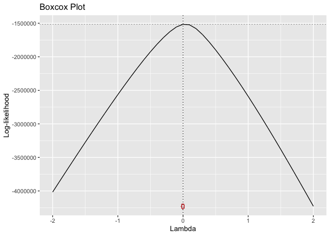
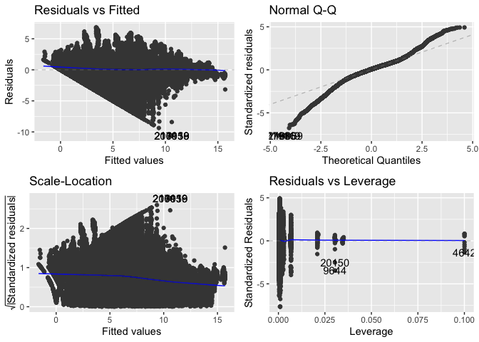

US Border Entry
================
Varun Vasudeva

This report aims to build a simple predictive model for the number of
entrants in a month given a year between 1996 and 2020, a port of entry,
and a mode of transportation. In it, we will explore the data and draw
inferences about trends, build successive linear regression models using
multiple predictors, and eventually validate the model to determine the
true error of prediction.

After loading the necessary libraries for analysis, we can read the data
from the comma-separated-value (CSV) file and view the first 6 entries.
The data was sourced from
<https://www.kaggle.com/divyansh22/us-border-crossing-data> and is a
dataset involving the US Border and crossing data related to it.

``` r
border <- read.csv("Border_Crossing_Entry_Data.csv")
head(border)
```

    ##        Port.Name State Port.Code           Border           Date
    ## 1          Alcan    AK      3104 US-Canada Border 2/1/2020 00:00
    ## 2          Alcan    AK      3104 US-Canada Border 2/1/2020 00:00
    ## 3          Alcan    AK      3104 US-Canada Border 2/1/2020 00:00
    ## 4          Alcan    AK      3104 US-Canada Border 2/1/2020 00:00
    ## 5          Alcan    AK      3104 US-Canada Border 2/1/2020 00:00
    ## 6 Alexandria Bay    NY       708 US-Canada Border 2/1/2020 00:00
    ##                       Measure Value
    ## 1 Personal Vehicle Passengers  1414
    ## 2           Personal Vehicles   763
    ## 3      Truck Containers Empty   412
    ## 4       Truck Containers Full   122
    ## 5                      Trucks   545
    ## 6              Bus Passengers  1174

Next, we need to reconstruct the data in order to assist with meaningful
exploratory data analysis (or EDA) so we can glean relevant information
from the graphs. We’ve extracted the year from the Date column and
allotted it to a separate column called `Year`.

We’ve also split the data into five sections: 1996 - 2000, 2001 - 2005,
2006 - 2010, 2011 - 2015, and 2016 - 2020. This will help us analyze
what happens to immigration into the United States over these five
periods, so we can gather a general trend.

``` r
border <- border %>%
  mutate(Year = format(as.Date(border$Date, format="%d/%m/%Y"),"%Y"),
         ModYear = case_when(Year >= 1996 & Year <= 2000 ~ "1996 - 2000",
                            Year >= 2001 & Year <= 2005 ~ "2001 - 2005",
                            Year >= 2006 & Year <= 2010 ~ "2006 - 2010",
                            Year >= 2011 & Year <= 2015 ~ "2011 - 2015",
                            Year >= 2016 & Year <= 2020 ~ "2016 - 2020")) %>%
  filter(!Value %in% c(0)) %>%
  drop_na()
head(border)
```

    ##        Port.Name State Port.Code           Border           Date
    ## 1          Alcan    AK      3104 US-Canada Border 2/1/2020 00:00
    ## 2          Alcan    AK      3104 US-Canada Border 2/1/2020 00:00
    ## 3          Alcan    AK      3104 US-Canada Border 2/1/2020 00:00
    ## 4          Alcan    AK      3104 US-Canada Border 2/1/2020 00:00
    ## 5          Alcan    AK      3104 US-Canada Border 2/1/2020 00:00
    ## 6 Alexandria Bay    NY       708 US-Canada Border 2/1/2020 00:00
    ##                       Measure Value Year     ModYear
    ## 1 Personal Vehicle Passengers  1414 2020 2016 - 2020
    ## 2           Personal Vehicles   763 2020 2016 - 2020
    ## 3      Truck Containers Empty   412 2020 2016 - 2020
    ## 4       Truck Containers Full   122 2020 2016 - 2020
    ## 5                      Trucks   545 2020 2016 - 2020
    ## 6              Bus Passengers  1174 2020 2016 - 2020

We’ve reconstructed the data in order to exclude Value entries that are
equal to 0, for purposes that will be discussed later on.

We can utilize a bar graph facet-wrapped by `ModYear` to observe a trend
in immigration patterns over the five splits from 1996 - 2020.

``` r
ggplot(border, aes(x = State, y = Value, col = State)) +
  geom_bar(stat = "identity") +
  facet_wrap(~ModYear) +
  theme(axis.text.x = element_text(angle = 60))
```

<!-- -->

We see clearly that Texas has the greatest immigration influx out of all
states that contribute to the influx of immigrants. California stands
second in terms of number of immigrants coming into the United States,
and Arizona stands third.

This indicates that the US-Mexico border is far busier than the
US-Canada border, which is a known fact. However, we see something more
interesting at play: immigration through Texas has been in decline over
the years, with the 2016-2020 season seeing the lowest number of
incoming immigrants from the other seasons begininng 1996, a decrease of
50 million the 1996 - 2000 season. California and Arizona, on the other
hand, have remained largely consistent as far as the number of
immigrants per season.

``` r
ggplot(border, aes(x = State, y = Value, col = State)) +
  geom_bar(stat = "identity") +
  facet_wrap(~Border) +
  theme(axis.text.x = element_text(angle = 45))
```

<!-- -->

Upon facet-wrapping the same data by `Border`, we can effectively
compare the two borders in terms of their total immigration from 1996 -
2020. We can see that Texas has nearly quadrupled the number of incoming
immigrants from the likes of New York and Michigan, and is around 33%
more than California.

New Mexico is the lowest contributor to the US-Mexico border and Ohio
seems to be the lowest contributor to the US-Canada border.

Next, we’ll create a full linear regression model both so we can see how
it performs and for the purpose of eliminating unnecessary variables
using the `step()` function, which will perform a stepwise elimination
of irrelevant variables. These following models are aimed at predicting
the number of incoming migrants from a particular port of entry in an
arbitrary month in a given year.

``` r
border.full <- lm(Value ~ Port.Name + State + Port.Code + Border + Measure + Year, data = border)
summary(border.full)
```

    ## 
    ## Call:
    ## lm(formula = Value ~ Port.Name + State + Port.Code + Border + 
    ##     Measure + Year, data = border)
    ## 
    ## Residuals:
    ##     Min      1Q  Median      3Q     Max 
    ## -788805  -43486    6897   39208 3915188 
    ## 
    ## Coefficients: (15 not defined because of singularities)
    ##                                      Estimate Std. Error t value Pr(>|t|)    
    ## (Intercept)                         -48664.12    3695.43 -13.169  < 2e-16 ***
    ## Port.NameAlexandria Bay              30397.63    4549.15   6.682 2.36e-11 ***
    ## Port.NameAlgonac                    -44491.04   25586.28  -1.739 0.082060 .  
    ## Port.NameAmbrose                    -42772.74    5548.44  -7.709 1.27e-14 ***
    ## Port.NameAnacortes                  -22322.37    6545.36  -3.410 0.000649 ***
    ## Port.NameAndrade                     25484.96    4919.51   5.180 2.22e-07 ***
    ## Port.NameAntler                     -25274.68    5093.20  -4.962 6.97e-07 ***
    ## Port.NameBar Harbor                 -11249.36   12335.66  -0.912 0.361802    
    ## Port.NameBaudette                    18019.61    4239.26   4.251 2.13e-05 ***
    ## Port.NameBeecher Falls               -6481.48    4745.62  -1.366 0.172008    
    ## Port.NameBlaine                     117025.43    4113.49  28.449  < 2e-16 ***
    ## Port.NameBoquillas                   12585.10   21306.48   0.591 0.554742    
    ## Port.NameBoundary                    16258.04    4540.93   3.580 0.000343 ***
    ## Port.NameBridgewater                -10874.29    4854.44  -2.240 0.025087 *  
    ## Port.NameBrownsville                189627.64    4131.72  45.896  < 2e-16 ***
    ## Port.NameBuffalo-Niagara Falls      191759.98    4092.40  46.858  < 2e-16 ***
    ## Port.NameCalais                      47732.17    4116.92  11.594  < 2e-16 ***
    ## Port.NameCalexico                   388326.23    5169.41  75.120  < 2e-16 ***
    ## Port.NameCalexico East               98686.84    4112.07  23.999  < 2e-16 ***
    ## Port.NameCape Vincent               -91154.64   12185.11  -7.481 7.41e-14 ***
    ## Port.NameCarbury                    -18554.49    4994.55  -3.715 0.000203 ***
    ## Port.NameChamplain-Rouses Point      59866.90    4089.48  14.639  < 2e-16 ***
    ## Port.NameColumbus                    14872.39    4459.52   3.335 0.000853 ***
    ## Port.NameCross Border Xpress        131377.58   27276.36   4.817 1.46e-06 ***
    ## Port.NameDalton Cache                -2987.61    4530.58  -0.659 0.509620    
    ## Port.NameDanville                     -331.25    4579.67  -0.072 0.942338    
    ## Port.NameDel Bonita                 -22963.85    5010.02  -4.584 4.57e-06 ***
    ## Port.NameDel Rio                     59831.03    4538.15  13.184  < 2e-16 ***
    ## Port.NameDerby Line                  23814.78    4412.80   5.397 6.79e-08 ***
    ## Port.NameDetroit                    186210.44    4151.27  44.856  < 2e-16 ***
    ## Port.NameDouglas                     72159.58    4415.46  16.342  < 2e-16 ***
    ## Port.NameDunseith                     2352.63    4589.72   0.513 0.608241    
    ## Port.NameEagle Pass                 103476.29    4095.97  25.263  < 2e-16 ***
    ## Port.NameEastport                     7713.09    4949.59   1.558 0.119157    
    ## Port.NameEl Paso                    377282.47    4091.12  92.220  < 2e-16 ***
    ## Port.NameFerry                      -23732.27    5049.45  -4.700 2.60e-06 ***
    ## Port.NameFort Fairfield              -4332.92    4747.67  -0.913 0.361432    
    ## Port.NameFort Kent                    1755.83    4529.18   0.388 0.698260    
    ## Port.NameFortuna                     -4045.58    4665.75  -0.867 0.385899    
    ## Port.NameFriday Harbor              -70583.86    7910.45  -8.923  < 2e-16 ***
    ## Port.NameFrontier                    11827.08    4336.04   2.728 0.006380 ** 
    ## Port.NameGrand Portage                9877.36    4538.92   2.176 0.029545 *  
    ## Port.NameHannah                     -35166.57    5345.09  -6.579 4.74e-11 ***
    ## Port.NameHansboro                    -2435.96    4636.03  -0.525 0.599277    
    ## Port.NameHidalgo                    252490.07    4415.91  57.177  < 2e-16 ***
    ## Port.NameHighgate Springs-Alburg     40322.74    4138.07   9.744  < 2e-16 ***
    ## Port.NameHoulton                     12996.34    4441.45   2.926 0.003432 ** 
    ## Port.NameInternational Falls-Ranier  39503.05    4087.73   9.664  < 2e-16 ***
    ## Port.NameJackman                     31083.04    4083.83   7.611 2.72e-14 ***
    ## Port.NameKetchikan                  -21391.58    6027.01  -3.549 0.000386 ***
    ## Port.NameLancaster                    3366.64    5166.21   0.652 0.514618    
    ## Port.NameLaredo                     234984.75    4133.72  56.846  < 2e-16 ***
    ## Port.NameLaurier                     24698.57    4167.04   5.927 3.09e-09 ***
    ## Port.NameLimestone                  -16249.85    4916.02  -3.305 0.000948 ***
    ## Port.NameLukeville                   12913.18    4569.73   2.826 0.004717 ** 
    ## Port.NameLynden                      18072.18    4551.31   3.971 7.17e-05 ***
    ## Port.NameMadawaska                   18267.45    4430.07   4.124 3.73e-05 ***
    ## Port.NameMaida                      -12382.25    4840.46  -2.558 0.010526 *  
    ## Port.NameMassena                     33925.56    4454.65   7.616 2.63e-14 ***
    ## Port.NameMetaline Falls                710.61    4493.73   0.158 0.874352    
    ## Port.NameMorgan                     -19582.57    4989.21  -3.925 8.68e-05 ***
    ## Port.NameNaco                         7160.39    4560.32   1.570 0.116381    
    ## Port.NameNeche                      -16131.28    4858.64  -3.320 0.000900 ***
    ## Port.NameNighthawk                  -62887.06    6011.78 -10.461  < 2e-16 ***
    ## Port.NameNogales                    146756.42    4077.79  35.989  < 2e-16 ***
    ## Port.NameNoonan                     -16763.44    4942.37  -3.392 0.000695 ***
    ## Port.NameNorthgate                    1844.58    4620.89   0.399 0.689759    
    ## Port.NameNorton                      25931.10    4157.19   6.238 4.45e-10 ***
    ## Port.NameNoyes                       14719.34    5314.96   2.769 0.005616 ** 
    ## Port.NameOgdensburg                  11538.41    4514.48   2.556 0.010593 *  
    ## Port.NameOpheim                     -27938.79    5232.88  -5.339 9.35e-08 ***
    ## Port.NameOroville                     9258.66    4442.36   2.084 0.037145 *  
    ## Port.NameOtay Mesa                  167460.31    4119.65  40.649  < 2e-16 ***
    ## Port.NamePembina                     33410.99    4260.85   7.841 4.47e-15 ***
    ## Port.NamePiegan                      -2666.60    4661.73  -0.572 0.567309    
    ## Port.NamePinecreek                  -23697.12    5065.19  -4.678 2.89e-06 ***
    ## Port.NamePoint Roberts               25992.21    4726.26   5.500 3.81e-08 ***
    ## Port.NamePort Angeles                -3848.89    5646.27  -0.682 0.495449    
    ## Port.NamePort Huron                  88405.07    4132.01  21.395  < 2e-16 ***
    ## Port.NamePortal                      30169.28    4093.34   7.370 1.71e-13 ***
    ## Port.NamePorthill                   -19130.85    6358.96  -3.008 0.002626 ** 
    ## Port.NamePortland                   -15390.78    7179.93  -2.144 0.032067 *  
    ## Port.NamePresidio                    28300.18    4354.05   6.500 8.06e-11 ***
    ## Port.NameProgreso                    48747.22    4517.55  10.791  < 2e-16 ***
    ## Port.NameRaymond                     -2474.19    4608.41  -0.537 0.591347    
    ## Port.NameRichford                    24792.22    4231.74   5.859 4.67e-09 ***
    ## Port.NameRio Grande City             13662.10    4747.10   2.878 0.004003 ** 
    ## Port.NameRoma                        40991.60    4414.13   9.286  < 2e-16 ***
    ## Port.NameRoosville                    4442.91    4432.68   1.002 0.316197    
    ## Port.NameRoseau                     -10928.37    4806.08  -2.274 0.022975 *  
    ## Port.NameSan Luis                   119266.23    4449.10  26.807  < 2e-16 ***
    ## Port.NameSan Ysidro                 843024.34    5079.81 165.956  < 2e-16 ***
    ## Port.NameSanta Teresa                14040.77    4455.18   3.152 0.001624 ** 
    ## Port.NameSarles                      -6665.03    4730.09  -1.409 0.158816    
    ## Port.NameSasabe                     -23991.87    4952.63  -4.844 1.27e-06 ***
    ## Port.NameSault Sainte Marie          54727.13    4163.43  13.145  < 2e-16 ***
    ## Port.NameScobey                     -25094.04    5242.16  -4.787 1.69e-06 ***
    ## Port.NameSherwood                   -19065.20    4960.02  -3.844 0.000121 ***
    ## Port.NameSkagway                      6900.54    4562.61   1.512 0.130431    
    ## Port.NameSt. John                    -9890.03    4821.29  -2.051 0.040237 *  
    ## Port.NameSumas                       46851.86    4085.08  11.469  < 2e-16 ***
    ## Port.NameSweetgrass                  33946.82    4069.66   8.341  < 2e-16 ***
    ## Port.NameTecate                      44163.39    4293.54  10.286  < 2e-16 ***
    ## Port.NameToledo-Sandusky            -42665.81   46194.75  -0.924 0.355692    
    ## Port.NameTornillo-Fabens            -12367.39    5721.01  -2.162 0.030638 *  
    ## Port.NameTrout River                 26849.29    4234.82   6.340 2.30e-10 ***
    ## Port.NameTurner                     -10358.85    4814.07  -2.152 0.031415 *  
    ## Port.NameVan Buren                   28450.71    4169.09   6.824 8.86e-12 ***
    ## Port.NameVanceboro                   23568.39    4180.00   5.638 1.72e-08 ***
    ## Port.NameWalhalla                   -14642.50    4902.24  -2.987 0.002819 ** 
    ## Port.NameWarroad                     16908.67    4274.77   3.955 7.64e-05 ***
    ## Port.NameWesthope                   -18882.73    4958.61  -3.808 0.000140 ***
    ## Port.NameWhitetail                  -43188.31    6315.69  -6.838 8.04e-12 ***
    ## Port.NameWhitlash                   -33133.17    5419.69  -6.113 9.76e-10 ***
    ## Port.NameWildhorse                  -13585.28    5682.06  -2.391 0.016808 *  
    ## Port.NameWillow Creek               -73177.90    8241.68  -8.879  < 2e-16 ***
    ## StateAZ                                    NA         NA      NA       NA    
    ## StateCA                                    NA         NA      NA       NA    
    ## StateID                              22079.28    4516.76   4.888 1.02e-06 ***
    ## StateME                                    NA         NA      NA       NA    
    ## StateMI                                    NA         NA      NA       NA    
    ## StateMN                                    NA         NA      NA       NA    
    ## StateMT                                    NA         NA      NA       NA    
    ## StateND                                    NA         NA      NA       NA    
    ## StateNM                                    NA         NA      NA       NA    
    ## StateNY                                    NA         NA      NA       NA    
    ## StateOH                                    NA         NA      NA       NA    
    ## StateTX                                    NA         NA      NA       NA    
    ## StateVT                                    NA         NA      NA       NA    
    ## StateWA                                    NA         NA      NA       NA    
    ## Port.Code                                  NA         NA      NA       NA    
    ## BorderUS-Mexico Border                     NA         NA      NA       NA    
    ## MeasureBuses                         -6424.26    1440.17  -4.461 8.17e-06 ***
    ## MeasurePedestrians                   48820.39    1503.84  32.464  < 2e-16 ***
    ## MeasurePersonal Vehicle Passengers  199545.63    1331.11 149.909  < 2e-16 ***
    ## MeasurePersonal Vehicles            102313.30    1330.12  76.920  < 2e-16 ***
    ## MeasureRail Containers Empty        -31596.74    1961.57 -16.108  < 2e-16 ***
    ## MeasureRail Containers Full         -26511.78    1979.75 -13.391  < 2e-16 ***
    ## MeasureTrain Passengers             -12707.01    1939.09  -6.553 5.65e-11 ***
    ## MeasureTrains                       -26493.07    1860.20 -14.242  < 2e-16 ***
    ## MeasureTruck Containers Empty        21292.53    1388.29  15.337  < 2e-16 ***
    ## MeasureTruck Containers Full         26174.36    1385.68  18.889  < 2e-16 ***
    ## MeasureTrucks                        32423.07    1346.37  24.082  < 2e-16 ***
    ## Year1997                              2703.96    2224.85   1.215 0.224236    
    ## Year1998                              5223.94    2186.35   2.389 0.016879 *  
    ## Year1999                              8200.44    2171.96   3.776 0.000160 ***
    ## Year2000                              8021.58    2160.62   3.713 0.000205 ***
    ## Year2001                              4021.72    2148.60   1.872 0.061238 .  
    ## Year2002                              1786.25    2153.51   0.829 0.406846    
    ## Year2003                                99.29    2158.18   0.046 0.963305    
    ## Year2004                              -379.61    2141.82  -0.177 0.859322    
    ## Year2005                             -1150.97    2141.32  -0.538 0.590921    
    ## Year2006                             -2812.46    2145.99  -1.311 0.190007    
    ## Year2007                             -4554.14    2161.14  -2.107 0.035093 *  
    ## Year2008                             -6912.43    2160.76  -3.199 0.001379 ** 
    ## Year2009                            -10612.67    2161.02  -4.911 9.07e-07 ***
    ## Year2010                            -12308.61    2164.87  -5.686 1.31e-08 ***
    ## Year2011                            -14336.94    2173.98  -6.595 4.27e-11 ***
    ## Year2012                            -12801.00    2172.89  -5.891 3.84e-09 ***
    ## Year2013                            -11770.33    2179.47  -5.401 6.65e-08 ***
    ## Year2014                            -11689.02    2180.22  -5.361 8.27e-08 ***
    ## Year2015                            -11200.40    2178.20  -5.142 2.72e-07 ***
    ## Year2016                            -11369.96    2178.86  -5.218 1.81e-07 ***
    ## Year2017                            -10541.00    2174.80  -4.847 1.26e-06 ***
    ## Year2018                            -10513.15    2179.35  -4.824 1.41e-06 ***
    ## Year2019                            -11332.20    2176.20  -5.207 1.92e-07 ***
    ## Year2020                            -15181.77    4033.48  -3.764 0.000167 ***
    ## ---
    ## Signif. codes:  0 '***' 0.001 '**' 0.01 '*' 0.05 '.' 0.1 ' ' 1
    ## 
    ## Residual standard error: 145700 on 232967 degrees of freedom
    ## Multiple R-squared:  0.3859, Adjusted R-squared:  0.3855 
    ## F-statistic: 969.4 on 151 and 232967 DF,  p-value: < 2.2e-16

Upon analyzing this model, we can see that it can definitely
significantly (p-value &lt; 2.2e-16) predict the number of immigrants
given the relevant information it needs. The model has an F-statistic =
969.4 on 151 and 232967 df with RSE = 145700 on 232967 df. We see a lot
of NA values for the `State` variable so we’ll create another model
omitting it.

``` r
border.reduced <- lm(Value ~ Port.Name + Port.Code + Border + Measure + Year, data = border)
summary(border.reduced)
```

    ## 
    ## Call:
    ## lm(formula = Value ~ Port.Name + Port.Code + Border + Measure + 
    ##     Year, data = border)
    ## 
    ## Residuals:
    ##     Min      1Q  Median      3Q     Max 
    ## -788805  -43486    6897   39208 3915188 
    ## 
    ## Coefficients: (1 not defined because of singularities)
    ##                                       Estimate Std. Error t value Pr(>|t|)    
    ## (Intercept)                         -70087.712   5751.634 -12.186  < 2e-16 ***
    ## Port.NameAlexandria Bay              46934.655   5669.607   8.278  < 2e-16 ***
    ## Port.NameAlgonac                    -49391.411  25606.220  -1.929 0.053747 .  
    ## Port.NameAmbrose                    -44884.733   5565.096  -8.065 7.33e-16 ***
    ## Port.NameAnacortes                  -21673.588   6546.494  -3.311 0.000931 ***
    ## Port.NameAndrade                     29639.923   4993.008   5.936 2.92e-09 ***
    ## Port.NameAntler                     -27407.374   5111.853  -5.362 8.26e-08 ***
    ## Port.NameBar Harbor                   9401.219  13035.502   0.721 0.470786    
    ## Port.NameBaudette                    15810.995   4261.974   3.710 0.000207 ***
    ## Port.NameBeecher Falls               13520.312   6265.691   2.158 0.030942 *  
    ## Port.NameBlaine                     117715.622   4116.766  28.594  < 2e-16 ***
    ## Port.NameBoquillas                   17375.038  21328.416   0.815 0.415278    
    ## Port.NameBoundary                    16872.312   4543.178   3.714 0.000204 ***
    ## Port.NameBridgewater                  9672.757   6421.733   1.506 0.132003    
    ## Port.NameBrownsville                195169.894   4289.502  45.499  < 2e-16 ***
    ## Port.NameBuffalo-Niagara Falls      206964.929   5153.517  40.160  < 2e-16 ***
    ## Port.NameCalais                      68362.039   5909.984  11.567  < 2e-16 ***
    ## Port.NameCalexico                   392474.288   5239.888  74.901  < 2e-16 ***
    ## Port.NameCalexico East              102807.291   4201.905  24.467  < 2e-16 ***
    ## Port.NameCape Vincent               -74603.808  12644.084  -5.900 3.63e-09 ***
    ## Port.NameCarbury                    -20742.406   5014.691  -4.136 3.53e-05 ***
    ## Port.NameChamplain-Rouses Point      76376.318   5317.930  14.362  < 2e-16 ***
    ## Port.NameColumbus                    19689.942   4566.967   4.311 1.62e-05 ***
    ## Port.NameCross Border Xpress        134980.384  27285.982   4.947 7.55e-07 ***
    ## Port.NameDalton Cache                -3001.412   4530.585  -0.662 0.507666    
    ## Port.NameDanville                      303.723   4581.951   0.066 0.947150    
    ## Port.NameDel Bonita                 -24468.468   5019.201  -4.875 1.09e-06 ***
    ## Port.NameDel Rio                     65366.379   4677.598  13.974  < 2e-16 ***
    ## Port.NameDerby Line                  43795.874   6015.564   7.280 3.34e-13 ***
    ## Port.NameDetroit                    181399.799   4260.692  42.575  < 2e-16 ***
    ## Port.NameDouglas                     75631.246   4472.261  16.911  < 2e-16 ***
    ## Port.NameDunseith                      157.815   4611.609   0.034 0.972701    
    ## Port.NameEagle Pass                 109004.732   4255.017  25.618  < 2e-16 ***
    ## Port.NameEastport                    28425.782   3986.597   7.130 1.00e-12 ***
    ## Port.NameEl Paso                    382127.627   4214.574  90.668  < 2e-16 ***
    ## Port.NameFerry                      -23104.195   5051.118  -4.574 4.79e-06 ***
    ## Port.NameFort Fairfield              16352.162   6360.832   2.571 0.010148 *  
    ## Port.NameFort Kent                   22420.210   6195.634   3.619 0.000296 ***
    ## Port.NameFortuna                     -6205.880   4686.583  -1.324 0.185444    
    ## Port.NameFriday Harbor              -69962.683   7911.301  -8.843  < 2e-16 ***
    ## Port.NameFrontier                    12406.845   4337.980   2.860 0.004236 ** 
    ## Port.NameGrand Portage                6364.272   4595.399   1.385 0.166077    
    ## Port.NameHannah                     -37264.759   5362.208  -6.950 3.67e-12 ***
    ## Port.NameHansboro                    -4582.461   4656.773  -0.984 0.325096    
    ## Port.NameHidalgo                    258004.709   4557.850  56.607  < 2e-16 ***
    ## Port.NameHighgate Springs-Alburg     60283.127   5830.522  10.339  < 2e-16 ***
    ## Port.NameHoulton                     33688.331   6135.359   5.491 4.00e-08 ***
    ## Port.NameInternational Falls-Ranier  36052.084   4144.470   8.699  < 2e-16 ***
    ## Port.NameJackman                     51788.831   5900.343   8.777  < 2e-16 ***
    ## Port.NameKetchikan                  -21377.774   6027.006  -3.547 0.000390 ***
    ## Port.NameLancaster                    1116.608   5187.548   0.215 0.829574    
    ## Port.NameLaredo                     240506.298   4290.270  56.059  < 2e-16 ***
    ## Port.NameLaurier                     25305.940   4169.561   6.069 1.29e-09 ***
    ## Port.NameLimestone                    4359.311   6477.120   0.673 0.500927    
    ## Port.NameLukeville                   16377.952   4624.618   3.541 0.000398 ***
    ## Port.NameLynden                      18631.236   4552.753   4.092 4.27e-05 ***
    ## Port.NameMadawaska                   38938.730   6125.149   6.357 2.06e-10 ***
    ## Port.NameMaida                      -14535.653   4860.418  -2.991 0.002784 ** 
    ## Port.NameMassena                     50490.192   5596.743   9.021  < 2e-16 ***
    ## Port.NameMetaline Falls               1255.859   4495.110   0.279 0.779951    
    ## Port.NameMorgan                     -21066.481   4998.389  -4.215 2.50e-05 ***
    ## Port.NameNaco                        10618.255   4614.705   2.301 0.021395 *  
    ## Port.NameNeche                      -18201.860   4877.006  -3.732 0.000190 ***
    ## Port.NameNighthawk                  -62245.178   6013.259 -10.351  < 2e-16 ***
    ## Port.NameNogales                    150207.385   4142.235  36.262  < 2e-16 ***
    ## Port.NameNoonan                     -18944.450   4962.377  -3.818 0.000135 ***
    ## Port.NameNorthgate                    -239.803   4639.487  -0.052 0.958778    
    ## Port.NameNorton                      45898.383   5846.368   7.851 4.15e-15 ***
    ## Port.NameNoyes                       12662.569   5328.550   2.376 0.017485 *  
    ## Port.NameOgdensburg                  28123.751   5647.797   4.980 6.38e-07 ***
    ## Port.NameOpheim                     -29408.897   5241.544  -5.611 2.02e-08 ***
    ## Port.NameOroville                     9845.323   4443.982   2.215 0.026732 *  
    ## Port.NameOtay Mesa                  171587.664   4209.235  40.765  < 2e-16 ***
    ## Port.NamePembina                     31361.115   4279.885   7.328 2.35e-13 ***
    ## Port.NamePiegan                      -4129.811   4671.200  -0.884 0.376643    
    ## Port.NamePinecreek                  -25912.644   5085.458  -5.095 3.48e-07 ***
    ## Port.NamePoint Roberts               26592.673   4727.851   5.625 1.86e-08 ***
    ## Port.NamePort Angeles                -3179.405   5647.697  -0.563 0.573465    
    ## Port.NamePort Huron                  83587.520   4242.027  19.705  < 2e-16 ***
    ## Port.NamePortal                      28105.598   4112.814   6.834 8.30e-12 ***
    ## Port.NamePorthill                     1540.428   4485.246   0.343 0.731265    
    ## Port.NamePortland                     5335.719   8344.021   0.639 0.522520    
    ## Port.NamePresidio                    33138.433   4466.359   7.420 1.18e-13 ***
    ## Port.NameProgreso                    54234.258   4655.177  11.650  < 2e-16 ***
    ## Port.NameRaymond                     -3833.868   4616.746  -0.830 0.406299    
    ## Port.NameRichford                    44814.720   5906.227   7.588 3.27e-14 ***
    ## Port.NameRio Grande City             19162.942   4878.676   3.928 8.57e-05 ***
    ## Port.NameRoma                        46471.730   4554.311  10.204  < 2e-16 ***
    ## Port.NameRoosville                    2965.894   4442.946   0.668 0.504421    
    ## Port.NameRoseau                     -13150.790   4827.401  -2.724 0.006446 ** 
    ## Port.NameSan Luis                   122689.585   4503.906  27.241  < 2e-16 ***
    ## Port.NameSan Ysidro                 847165.498   5149.757 164.506  < 2e-16 ***
    ## Port.NameSanta Teresa                18844.516   4562.157   4.131 3.62e-05 ***
    ## Port.NameSarles                      -8770.114   4749.780  -1.846 0.064832 .  
    ## Port.NameSasabe                     -20554.713   5002.377  -4.109 3.98e-05 ***
    ## Port.NameSault Sainte Marie          49902.682   4273.177  11.678  < 2e-16 ***
    ## Port.NameScobey                     -26508.932   5250.210  -5.049 4.44e-07 ***
    ## Port.NameSherwood                   -21204.799   4979.240  -4.259 2.06e-05 ***
    ## Port.NameSkagway                      6907.444   4562.612   1.514 0.130047    
    ## Port.NameSt. John                   -11967.515   4840.030  -2.473 0.013414 *  
    ## Port.NameSumas                       47507.548   4088.018  11.621  < 2e-16 ***
    ## Port.NameSweetgrass                  32525.019   4078.391   7.975 1.53e-15 ***
    ## Port.NameTecate                      48297.651   4378.245  11.031  < 2e-16 ***
    ## Port.NameToledo-Sandusky            -49574.638  46216.630  -1.073 0.283426    
    ## Port.NameTornillo-Fabens             -7536.037   5805.861  -1.298 0.194287    
    ## Port.NameTrout River                 43338.007   5429.711   7.982 1.45e-15 ***
    ## Port.NameTurner                     -11753.044   4822.460  -2.437 0.014804 *  
    ## Port.NameVan Buren                   49128.891   5956.652   8.248  < 2e-16 ***
    ## Port.NameVanceboro                   44267.282   5968.937   7.416 1.21e-13 ***
    ## Port.NameWalhalla                   -16733.781   4920.861  -3.401 0.000673 ***
    ## Port.NameWarroad                     14706.954   4297.104   3.423 0.000621 ***
    ## Port.NameWesthope                   -21056.837   4978.468  -4.230 2.34e-05 ***
    ## Port.NameWhitetail                  -44623.908   6322.231  -7.058 1.69e-12 ***
    ## Port.NameWhitlash                   -34630.892   5428.473  -6.379 1.78e-10 ***
    ## Port.NameWildhorse                  -15096.802   5691.003  -2.653 0.007984 ** 
    ## Port.NameWillow Creek               -74703.222   8247.967  -9.057  < 2e-16 ***
    ## Port.Code                                6.902      1.412   4.888 1.02e-06 ***
    ## BorderUS-Mexico Border                      NA         NA      NA       NA    
    ## MeasureBuses                         -6424.263   1440.174  -4.461 8.17e-06 ***
    ## MeasurePedestrians                   48820.394   1503.843  32.464  < 2e-16 ***
    ## MeasurePersonal Vehicle Passengers  199545.630   1331.114 149.909  < 2e-16 ***
    ## MeasurePersonal Vehicles            102313.297   1330.118  76.920  < 2e-16 ***
    ## MeasureRail Containers Empty        -31596.737   1961.572 -16.108  < 2e-16 ***
    ## MeasureRail Containers Full         -26511.781   1979.754 -13.391  < 2e-16 ***
    ## MeasureTrain Passengers             -12707.008   1939.091  -6.553 5.65e-11 ***
    ## MeasureTrains                       -26493.069   1860.196 -14.242  < 2e-16 ***
    ## MeasureTruck Containers Empty        21292.526   1388.287  15.337  < 2e-16 ***
    ## MeasureTruck Containers Full         26174.357   1385.682  18.889  < 2e-16 ***
    ## MeasureTrucks                        32423.070   1346.371  24.082  < 2e-16 ***
    ## Year1997                              2703.962   2224.852   1.215 0.224236    
    ## Year1998                              5223.942   2186.346   2.389 0.016879 *  
    ## Year1999                              8200.443   2171.965   3.776 0.000160 ***
    ## Year2000                              8021.581   2160.617   3.713 0.000205 ***
    ## Year2001                              4021.717   2148.604   1.872 0.061238 .  
    ## Year2002                              1786.249   2153.511   0.829 0.406846    
    ## Year2003                                99.290   2158.183   0.046 0.963305    
    ## Year2004                              -379.610   2141.818  -0.177 0.859322    
    ## Year2005                             -1150.966   2141.320  -0.538 0.590921    
    ## Year2006                             -2812.458   2145.994  -1.311 0.190007    
    ## Year2007                             -4554.144   2161.138  -2.107 0.035093 *  
    ## Year2008                             -6912.433   2160.762  -3.199 0.001379 ** 
    ## Year2009                            -10612.671   2161.023  -4.911 9.07e-07 ***
    ## Year2010                            -12308.613   2164.873  -5.686 1.31e-08 ***
    ## Year2011                            -14336.938   2173.980  -6.595 4.27e-11 ***
    ## Year2012                            -12800.996   2172.887  -5.891 3.84e-09 ***
    ## Year2013                            -11770.335   2179.470  -5.401 6.65e-08 ***
    ## Year2014                            -11689.017   2180.224  -5.361 8.27e-08 ***
    ## Year2015                            -11200.396   2178.196  -5.142 2.72e-07 ***
    ## Year2016                            -11369.959   2178.857  -5.218 1.81e-07 ***
    ## Year2017                            -10541.000   2174.804  -4.847 1.26e-06 ***
    ## Year2018                            -10513.150   2179.352  -4.824 1.41e-06 ***
    ## Year2019                            -11332.196   2176.197  -5.207 1.92e-07 ***
    ## Year2020                            -15181.771   4033.482  -3.764 0.000167 ***
    ## ---
    ## Signif. codes:  0 '***' 0.001 '**' 0.01 '*' 0.05 '.' 0.1 ' ' 1
    ## 
    ## Residual standard error: 145700 on 232967 degrees of freedom
    ## Multiple R-squared:  0.3859, Adjusted R-squared:  0.3855 
    ## F-statistic: 969.4 on 151 and 232967 DF,  p-value: < 2.2e-16

However, we want to see whether the model can be improved (or even kept
largely the same) without the presence of as many variables. Now, we
create the backward stepwise model.

``` r
border.backward <- step(border.reduced, direction = "backward")
```

    ## Start:  AIC=5543302
    ## Value ~ Port.Name + Port.Code + Border + Measure + Year
    ## 
    ## 
    ## Step:  AIC=5543302
    ## Value ~ Port.Name + Port.Code + Measure + Year
    ## 
    ##              Df  Sum of Sq        RSS     AIC
    ## <none>                     4.9435e+15 5543302
    ## - Port.Code   1 5.0706e+11 4.9440e+15 5543324
    ## - Year       24 1.1691e+13 4.9552e+15 5543804
    ## - Measure    11 1.0305e+15 5.9740e+15 5587419
    ## - Port.Name 115 2.2001e+15 7.1436e+15 5628894

This process removed the variable `Border`. It is understandable that
`Border` does not need to be present in the model as `Border` simply
reaffirms what `Port.Name` already tells us. It also makes sense that we
need the year along with what measure of travel we’re trying to predict
the influx of immigrants for.

``` r
summary(border.backward)
```

    ## 
    ## Call:
    ## lm(formula = Value ~ Port.Name + Port.Code + Measure + Year, 
    ##     data = border)
    ## 
    ## Residuals:
    ##     Min      1Q  Median      3Q     Max 
    ## -788805  -43486    6897   39208 3915188 
    ## 
    ## Coefficients:
    ##                                       Estimate Std. Error t value Pr(>|t|)    
    ## (Intercept)                         -70087.712   5751.634 -12.186  < 2e-16 ***
    ## Port.NameAlexandria Bay              46934.655   5669.607   8.278  < 2e-16 ***
    ## Port.NameAlgonac                    -49391.411  25606.220  -1.929 0.053747 .  
    ## Port.NameAmbrose                    -44884.733   5565.096  -8.065 7.33e-16 ***
    ## Port.NameAnacortes                  -21673.588   6546.494  -3.311 0.000931 ***
    ## Port.NameAndrade                     29639.923   4993.008   5.936 2.92e-09 ***
    ## Port.NameAntler                     -27407.374   5111.853  -5.362 8.26e-08 ***
    ## Port.NameBar Harbor                   9401.219  13035.502   0.721 0.470786    
    ## Port.NameBaudette                    15810.995   4261.974   3.710 0.000207 ***
    ## Port.NameBeecher Falls               13520.312   6265.691   2.158 0.030942 *  
    ## Port.NameBlaine                     117715.622   4116.766  28.594  < 2e-16 ***
    ## Port.NameBoquillas                   17375.038  21328.416   0.815 0.415278    
    ## Port.NameBoundary                    16872.312   4543.178   3.714 0.000204 ***
    ## Port.NameBridgewater                  9672.757   6421.733   1.506 0.132003    
    ## Port.NameBrownsville                195169.894   4289.502  45.499  < 2e-16 ***
    ## Port.NameBuffalo-Niagara Falls      206964.929   5153.517  40.160  < 2e-16 ***
    ## Port.NameCalais                      68362.039   5909.984  11.567  < 2e-16 ***
    ## Port.NameCalexico                   392474.288   5239.888  74.901  < 2e-16 ***
    ## Port.NameCalexico East              102807.291   4201.905  24.467  < 2e-16 ***
    ## Port.NameCape Vincent               -74603.808  12644.084  -5.900 3.63e-09 ***
    ## Port.NameCarbury                    -20742.406   5014.691  -4.136 3.53e-05 ***
    ## Port.NameChamplain-Rouses Point      76376.318   5317.930  14.362  < 2e-16 ***
    ## Port.NameColumbus                    19689.942   4566.967   4.311 1.62e-05 ***
    ## Port.NameCross Border Xpress        134980.384  27285.982   4.947 7.55e-07 ***
    ## Port.NameDalton Cache                -3001.412   4530.585  -0.662 0.507666    
    ## Port.NameDanville                      303.723   4581.951   0.066 0.947150    
    ## Port.NameDel Bonita                 -24468.468   5019.201  -4.875 1.09e-06 ***
    ## Port.NameDel Rio                     65366.379   4677.598  13.974  < 2e-16 ***
    ## Port.NameDerby Line                  43795.874   6015.564   7.280 3.34e-13 ***
    ## Port.NameDetroit                    181399.799   4260.692  42.575  < 2e-16 ***
    ## Port.NameDouglas                     75631.246   4472.261  16.911  < 2e-16 ***
    ## Port.NameDunseith                      157.815   4611.609   0.034 0.972701    
    ## Port.NameEagle Pass                 109004.732   4255.017  25.618  < 2e-16 ***
    ## Port.NameEastport                    28425.782   3986.597   7.130 1.00e-12 ***
    ## Port.NameEl Paso                    382127.627   4214.574  90.668  < 2e-16 ***
    ## Port.NameFerry                      -23104.195   5051.118  -4.574 4.79e-06 ***
    ## Port.NameFort Fairfield              16352.162   6360.832   2.571 0.010148 *  
    ## Port.NameFort Kent                   22420.210   6195.634   3.619 0.000296 ***
    ## Port.NameFortuna                     -6205.880   4686.583  -1.324 0.185444    
    ## Port.NameFriday Harbor              -69962.683   7911.301  -8.843  < 2e-16 ***
    ## Port.NameFrontier                    12406.845   4337.980   2.860 0.004236 ** 
    ## Port.NameGrand Portage                6364.272   4595.399   1.385 0.166077    
    ## Port.NameHannah                     -37264.759   5362.208  -6.950 3.67e-12 ***
    ## Port.NameHansboro                    -4582.461   4656.773  -0.984 0.325096    
    ## Port.NameHidalgo                    258004.709   4557.850  56.607  < 2e-16 ***
    ## Port.NameHighgate Springs-Alburg     60283.127   5830.522  10.339  < 2e-16 ***
    ## Port.NameHoulton                     33688.331   6135.359   5.491 4.00e-08 ***
    ## Port.NameInternational Falls-Ranier  36052.084   4144.470   8.699  < 2e-16 ***
    ## Port.NameJackman                     51788.831   5900.343   8.777  < 2e-16 ***
    ## Port.NameKetchikan                  -21377.774   6027.006  -3.547 0.000390 ***
    ## Port.NameLancaster                    1116.608   5187.548   0.215 0.829574    
    ## Port.NameLaredo                     240506.298   4290.270  56.059  < 2e-16 ***
    ## Port.NameLaurier                     25305.940   4169.561   6.069 1.29e-09 ***
    ## Port.NameLimestone                    4359.311   6477.120   0.673 0.500927    
    ## Port.NameLukeville                   16377.952   4624.618   3.541 0.000398 ***
    ## Port.NameLynden                      18631.236   4552.753   4.092 4.27e-05 ***
    ## Port.NameMadawaska                   38938.730   6125.149   6.357 2.06e-10 ***
    ## Port.NameMaida                      -14535.653   4860.418  -2.991 0.002784 ** 
    ## Port.NameMassena                     50490.192   5596.743   9.021  < 2e-16 ***
    ## Port.NameMetaline Falls               1255.859   4495.110   0.279 0.779951    
    ## Port.NameMorgan                     -21066.481   4998.389  -4.215 2.50e-05 ***
    ## Port.NameNaco                        10618.255   4614.705   2.301 0.021395 *  
    ## Port.NameNeche                      -18201.860   4877.006  -3.732 0.000190 ***
    ## Port.NameNighthawk                  -62245.178   6013.259 -10.351  < 2e-16 ***
    ## Port.NameNogales                    150207.385   4142.235  36.262  < 2e-16 ***
    ## Port.NameNoonan                     -18944.450   4962.377  -3.818 0.000135 ***
    ## Port.NameNorthgate                    -239.803   4639.487  -0.052 0.958778    
    ## Port.NameNorton                      45898.383   5846.368   7.851 4.15e-15 ***
    ## Port.NameNoyes                       12662.569   5328.550   2.376 0.017485 *  
    ## Port.NameOgdensburg                  28123.751   5647.797   4.980 6.38e-07 ***
    ## Port.NameOpheim                     -29408.897   5241.544  -5.611 2.02e-08 ***
    ## Port.NameOroville                     9845.323   4443.982   2.215 0.026732 *  
    ## Port.NameOtay Mesa                  171587.664   4209.235  40.765  < 2e-16 ***
    ## Port.NamePembina                     31361.115   4279.885   7.328 2.35e-13 ***
    ## Port.NamePiegan                      -4129.811   4671.200  -0.884 0.376643    
    ## Port.NamePinecreek                  -25912.644   5085.458  -5.095 3.48e-07 ***
    ## Port.NamePoint Roberts               26592.673   4727.851   5.625 1.86e-08 ***
    ## Port.NamePort Angeles                -3179.405   5647.697  -0.563 0.573465    
    ## Port.NamePort Huron                  83587.520   4242.027  19.705  < 2e-16 ***
    ## Port.NamePortal                      28105.598   4112.814   6.834 8.30e-12 ***
    ## Port.NamePorthill                     1540.428   4485.246   0.343 0.731265    
    ## Port.NamePortland                     5335.719   8344.021   0.639 0.522520    
    ## Port.NamePresidio                    33138.433   4466.359   7.420 1.18e-13 ***
    ## Port.NameProgreso                    54234.258   4655.177  11.650  < 2e-16 ***
    ## Port.NameRaymond                     -3833.868   4616.746  -0.830 0.406299    
    ## Port.NameRichford                    44814.720   5906.227   7.588 3.27e-14 ***
    ## Port.NameRio Grande City             19162.942   4878.676   3.928 8.57e-05 ***
    ## Port.NameRoma                        46471.730   4554.311  10.204  < 2e-16 ***
    ## Port.NameRoosville                    2965.894   4442.946   0.668 0.504421    
    ## Port.NameRoseau                     -13150.790   4827.401  -2.724 0.006446 ** 
    ## Port.NameSan Luis                   122689.585   4503.906  27.241  < 2e-16 ***
    ## Port.NameSan Ysidro                 847165.498   5149.757 164.506  < 2e-16 ***
    ## Port.NameSanta Teresa                18844.516   4562.157   4.131 3.62e-05 ***
    ## Port.NameSarles                      -8770.114   4749.780  -1.846 0.064832 .  
    ## Port.NameSasabe                     -20554.713   5002.377  -4.109 3.98e-05 ***
    ## Port.NameSault Sainte Marie          49902.682   4273.177  11.678  < 2e-16 ***
    ## Port.NameScobey                     -26508.932   5250.210  -5.049 4.44e-07 ***
    ## Port.NameSherwood                   -21204.799   4979.240  -4.259 2.06e-05 ***
    ## Port.NameSkagway                      6907.444   4562.612   1.514 0.130047    
    ## Port.NameSt. John                   -11967.515   4840.030  -2.473 0.013414 *  
    ## Port.NameSumas                       47507.548   4088.018  11.621  < 2e-16 ***
    ## Port.NameSweetgrass                  32525.019   4078.391   7.975 1.53e-15 ***
    ## Port.NameTecate                      48297.651   4378.245  11.031  < 2e-16 ***
    ## Port.NameToledo-Sandusky            -49574.638  46216.630  -1.073 0.283426    
    ## Port.NameTornillo-Fabens             -7536.037   5805.861  -1.298 0.194287    
    ## Port.NameTrout River                 43338.007   5429.711   7.982 1.45e-15 ***
    ## Port.NameTurner                     -11753.044   4822.460  -2.437 0.014804 *  
    ## Port.NameVan Buren                   49128.891   5956.652   8.248  < 2e-16 ***
    ## Port.NameVanceboro                   44267.282   5968.937   7.416 1.21e-13 ***
    ## Port.NameWalhalla                   -16733.781   4920.861  -3.401 0.000673 ***
    ## Port.NameWarroad                     14706.954   4297.104   3.423 0.000621 ***
    ## Port.NameWesthope                   -21056.837   4978.468  -4.230 2.34e-05 ***
    ## Port.NameWhitetail                  -44623.908   6322.231  -7.058 1.69e-12 ***
    ## Port.NameWhitlash                   -34630.892   5428.473  -6.379 1.78e-10 ***
    ## Port.NameWildhorse                  -15096.802   5691.003  -2.653 0.007984 ** 
    ## Port.NameWillow Creek               -74703.222   8247.967  -9.057  < 2e-16 ***
    ## Port.Code                                6.902      1.412   4.888 1.02e-06 ***
    ## MeasureBuses                         -6424.263   1440.174  -4.461 8.17e-06 ***
    ## MeasurePedestrians                   48820.394   1503.843  32.464  < 2e-16 ***
    ## MeasurePersonal Vehicle Passengers  199545.630   1331.114 149.909  < 2e-16 ***
    ## MeasurePersonal Vehicles            102313.297   1330.118  76.920  < 2e-16 ***
    ## MeasureRail Containers Empty        -31596.737   1961.572 -16.108  < 2e-16 ***
    ## MeasureRail Containers Full         -26511.781   1979.754 -13.391  < 2e-16 ***
    ## MeasureTrain Passengers             -12707.008   1939.091  -6.553 5.65e-11 ***
    ## MeasureTrains                       -26493.069   1860.196 -14.242  < 2e-16 ***
    ## MeasureTruck Containers Empty        21292.526   1388.287  15.337  < 2e-16 ***
    ## MeasureTruck Containers Full         26174.357   1385.682  18.889  < 2e-16 ***
    ## MeasureTrucks                        32423.070   1346.371  24.082  < 2e-16 ***
    ## Year1997                              2703.962   2224.852   1.215 0.224236    
    ## Year1998                              5223.942   2186.346   2.389 0.016879 *  
    ## Year1999                              8200.443   2171.965   3.776 0.000160 ***
    ## Year2000                              8021.581   2160.617   3.713 0.000205 ***
    ## Year2001                              4021.717   2148.604   1.872 0.061238 .  
    ## Year2002                              1786.249   2153.511   0.829 0.406846    
    ## Year2003                                99.290   2158.183   0.046 0.963305    
    ## Year2004                              -379.610   2141.818  -0.177 0.859322    
    ## Year2005                             -1150.966   2141.320  -0.538 0.590921    
    ## Year2006                             -2812.458   2145.994  -1.311 0.190007    
    ## Year2007                             -4554.144   2161.138  -2.107 0.035093 *  
    ## Year2008                             -6912.433   2160.762  -3.199 0.001379 ** 
    ## Year2009                            -10612.671   2161.023  -4.911 9.07e-07 ***
    ## Year2010                            -12308.613   2164.873  -5.686 1.31e-08 ***
    ## Year2011                            -14336.938   2173.980  -6.595 4.27e-11 ***
    ## Year2012                            -12800.996   2172.887  -5.891 3.84e-09 ***
    ## Year2013                            -11770.335   2179.470  -5.401 6.65e-08 ***
    ## Year2014                            -11689.017   2180.224  -5.361 8.27e-08 ***
    ## Year2015                            -11200.396   2178.196  -5.142 2.72e-07 ***
    ## Year2016                            -11369.959   2178.857  -5.218 1.81e-07 ***
    ## Year2017                            -10541.000   2174.804  -4.847 1.26e-06 ***
    ## Year2018                            -10513.150   2179.352  -4.824 1.41e-06 ***
    ## Year2019                            -11332.196   2176.197  -5.207 1.92e-07 ***
    ## Year2020                            -15181.771   4033.482  -3.764 0.000167 ***
    ## ---
    ## Signif. codes:  0 '***' 0.001 '**' 0.01 '*' 0.05 '.' 0.1 ' ' 1
    ## 
    ## Residual standard error: 145700 on 232967 degrees of freedom
    ## Multiple R-squared:  0.3859, Adjusted R-squared:  0.3855 
    ## F-statistic: 969.4 on 151 and 232967 DF,  p-value: < 2.2e-16

``` r
autoplot(border.backward)
```

<!-- -->

This backwards stepwise model has an F-statistic = 969.4 on 151 and
232967 df with RSE = 145700 on 232967 df. The p-value, Adjusted
R-squared, and RSE are the same as the reduced model, but the model is
simpler and requires less data for predictive purposes, so this is the
one we keep and carry on with.

However, we see major issues with normality and the Residuals
vs. Leverage plot having an extremely high y-axis range. We can run a
Box-Cox test in order to determine how to fix these issues. This is why
we reconstructed the data to remove all Value entries that were 0. In
case a log transformation is necessary, data points with a Value = 0
would throw off the test and make it impossible to diagnose the rest of
the data points.

``` r
gg_boxcox(border.backward)
```

<!-- -->

As we can see from the output above, the ideal *λ* value = 0, meaning a
log transformation would suffice in attempting to fix issues as shown by
the `autoplot()` function. We now create a new model called `border.fit`
in order to improve on the backward stepwise model. In this mode,
however, we will omit `Port.Code` simply because having the value for
`Port.Name` gives us the value for `Port.Code` already.

``` r
border.fit <- lm(log(Value) ~ Port.Name + Measure + Year, data = border)
summary(border.fit)
```

    ## 
    ## Call:
    ## lm(formula = log(Value) ~ Port.Name + Measure + Year, data = border)
    ## 
    ## Residuals:
    ##      Min       1Q   Median       3Q      Max 
    ## -10.6057  -0.7052   0.0979   0.8087   6.8272 
    ## 
    ## Coefficients:
    ##                                      Estimate Std. Error  t value Pr(>|t|)    
    ## (Intercept)                          4.519881   0.035173  128.503  < 2e-16 ***
    ## Port.NameAlexandria Bay              3.248531   0.043300   75.023  < 2e-16 ***
    ## Port.NameAlgonac                    -0.093089   0.243538   -0.382 0.702288    
    ## Port.NameAmbrose                    -3.090557   0.052812  -58.520  < 2e-16 ***
    ## Port.NameAnacortes                  -0.235401   0.062301   -3.778 0.000158 ***
    ## Port.NameAndrade                     1.999241   0.046825   42.696  < 2e-16 ***
    ## Port.NameAntler                     -1.431819   0.048479  -29.535  < 2e-16 ***
    ## Port.NameBar Harbor                 -0.246048   0.117415   -2.096 0.036124 *  
    ## Port.NameBaudette                    1.181328   0.040350   29.277  < 2e-16 ***
    ## Port.NameBeecher Falls               0.377945   0.045170    8.367  < 2e-16 ***
    ## Port.NameBlaine                      4.621501   0.039153  118.038  < 2e-16 ***
    ## Port.NameBoquillas                   2.587943   0.202802   12.761  < 2e-16 ***
    ## Port.NameBoundary                   -0.209206   0.043222   -4.840 1.30e-06 ***
    ## Port.NameBridgewater                 0.482722   0.046206   10.447  < 2e-16 ***
    ## Port.NameBrownsville                 4.478710   0.039327  113.885  < 2e-16 ***
    ## Port.NameBuffalo-Niagara Falls       5.240221   0.038952  134.530  < 2e-16 ***
    ## Port.NameCalais                      2.031530   0.039186   51.844  < 2e-16 ***
    ## Port.NameCalexico                    4.887009   0.049204   99.321  < 2e-16 ***
    ## Port.NameCalexico East               3.061801   0.039139   78.228  < 2e-16 ***
    ## Port.NameCape Vincent               -1.058943   0.115982   -9.130  < 2e-16 ***
    ## Port.NameCarbury                    -1.301708   0.047540  -27.382  < 2e-16 ***
    ## Port.NameChamplain-Rouses Point      3.858919   0.038924   99.139  < 2e-16 ***
    ## Port.NameColumbus                    1.948804   0.042447   45.911  < 2e-16 ***
    ## Port.NameCross Border Xpress         7.169426   0.259625   27.615  < 2e-16 ***
    ## Port.NameDalton Cache               -0.847475   0.043124  -19.652  < 2e-16 ***
    ## Port.NameDanville                   -0.525917   0.043590  -12.065  < 2e-16 ***
    ## Port.NameDel Bonita                 -1.266752   0.047687  -26.564  < 2e-16 ***
    ## Port.NameDel Rio                     3.195879   0.043196   73.986  < 2e-16 ***
    ## Port.NameDerby Line                  2.791201   0.042002   66.453  < 2e-16 ***
    ## Port.NameDetroit                     5.199364   0.039512  131.588  < 2e-16 ***
    ## Port.NameDouglas                     3.387465   0.042028   80.601  < 2e-16 ***
    ## Port.NameDunseith                    1.032528   0.043686   23.635  < 2e-16 ***
    ## Port.NameEagle Pass                  4.002839   0.038986  102.673  < 2e-16 ***
    ## Port.NameEastport                    1.394455   0.036464   38.242  < 2e-16 ***
    ## Port.NameEl Paso                     5.189376   0.038940  133.266  < 2e-16 ***
    ## Port.NameFerry                      -1.527818   0.048062  -31.788  < 2e-16 ***
    ## Port.NameFort Fairfield              0.717474   0.045190   15.877  < 2e-16 ***
    ## Port.NameFort Kent                   0.953256   0.043110   22.112  < 2e-16 ***
    ## Port.NameFortuna                    -0.519435   0.044410  -11.696  < 2e-16 ***
    ## Port.NameFriday Harbor              -2.047530   0.075294  -27.194  < 2e-16 ***
    ## Port.NameFrontier                    0.737527   0.041272   17.870  < 2e-16 ***
    ## Port.NameGrand Portage               2.065242   0.043203   47.803  < 2e-16 ***
    ## Port.NameHannah                     -2.959329   0.050876  -58.167  < 2e-16 ***
    ## Port.NameHansboro                   -1.071714   0.044127  -24.287  < 2e-16 ***
    ## Port.NameHidalgo                     5.528561   0.042032  131.532  < 2e-16 ***
    ## Port.NameHighgate Springs-Alburg     2.558227   0.039387   64.951  < 2e-16 ***
    ## Port.NameHoulton                     1.843046   0.042275   43.597  < 2e-16 ***
    ## Port.NameInternational Falls-Ranier  2.884034   0.038908   74.125  < 2e-16 ***
    ## Port.NameJackman                     1.794180   0.038871   46.158  < 2e-16 ***
    ## Port.NameKetchikan                  -2.082358   0.057367  -36.299  < 2e-16 ***
    ## Port.NameLancaster                   0.224208   0.049173    4.560 5.13e-06 ***
    ## Port.NameLaredo                      5.861553   0.039346  148.976  < 2e-16 ***
    ## Port.NameLaurier                     0.271048   0.039663    6.834 8.29e-12 ***
    ## Port.NameLimestone                  -0.298883   0.046792   -6.387 1.69e-10 ***
    ## Port.NameLukeville                   1.250620   0.043496   28.752  < 2e-16 ***
    ## Port.NameLynden                      1.913027   0.043321   44.160  < 2e-16 ***
    ## Port.NameMadawaska                   1.483969   0.042167   35.193  < 2e-16 ***
    ## Port.NameMaida                      -1.121493   0.046073  -24.342  < 2e-16 ***
    ## Port.NameMassena                     2.328950   0.042401   54.927  < 2e-16 ***
    ## Port.NameMetaline Falls             -0.255138   0.042773   -5.965 2.45e-09 ***
    ## Port.NameMorgan                     -1.731542   0.047489  -36.462  < 2e-16 ***
    ## Port.NameNaco                        1.313674   0.043407   30.264  < 2e-16 ***
    ## Port.NameNeche                       0.406476   0.046246    8.789  < 2e-16 ***
    ## Port.NameNighthawk                  -2.231108   0.057222  -38.990  < 2e-16 ***
    ## Port.NameNogales                     4.348573   0.038813  112.039  < 2e-16 ***
    ## Port.NameNoonan                     -0.506016   0.047043  -10.756  < 2e-16 ***
    ## Port.NameNorthgate                   0.002658   0.043983    0.060 0.951806    
    ## Port.NameNorton                      0.997196   0.039569   25.202  < 2e-16 ***
    ## Port.NameNoyes                       1.004390   0.050588   19.854  < 2e-16 ***
    ## Port.NameOgdensburg                  1.641468   0.042970   38.200  < 2e-16 ***
    ## Port.NameOpheim                     -2.180761   0.049808  -43.783  < 2e-16 ***
    ## Port.NameOroville                    1.681298   0.042284   39.762  < 2e-16 ***
    ## Port.NameOtay Mesa                   4.339119   0.039212  110.659  < 2e-16 ***
    ## Port.NamePembina                     3.109926   0.040556   76.683  < 2e-16 ***
    ## Port.NamePiegan                      0.017377   0.044372    0.392 0.695339    
    ## Port.NamePinecreek                  -2.067337   0.048212  -42.880  < 2e-16 ***
    ## Port.NamePoint Roberts               2.339045   0.044986   51.995  < 2e-16 ***
    ## Port.NamePort Angeles               -0.198818   0.053743   -3.699 0.000216 ***
    ## Port.NamePort Huron                  4.683269   0.039329  119.079  < 2e-16 ***
    ## Port.NamePortal                      2.624189   0.038961   67.354  < 2e-16 ***
    ## Port.NamePorthill                    0.318260   0.042604    7.470 8.03e-14 ***
    ## Port.NamePortland                   -0.389450   0.068341   -5.699 1.21e-08 ***
    ## Port.NamePresidio                    1.742732   0.041443   42.051  < 2e-16 ***
    ## Port.NameProgreso                    3.010474   0.042999   70.012  < 2e-16 ***
    ## Port.NameRaymond                     0.408523   0.043864    9.313  < 2e-16 ***
    ## Port.NameRichford                    0.634376   0.040278   15.750  < 2e-16 ***
    ## Port.NameRio Grande City             2.517388   0.045184   55.714  < 2e-16 ***
    ## Port.NameRoma                        2.629238   0.042015   62.579  < 2e-16 ***
    ## Port.NameRoosville                   0.787999   0.042192   18.677  < 2e-16 ***
    ## Port.NameRoseau                      0.206783   0.045746    4.520 6.18e-06 ***
    ## Port.NameSan Luis                    2.888700   0.042348   68.214  < 2e-16 ***
    ## Port.NameSan Ysidro                  6.741292   0.048351  139.423  < 2e-16 ***
    ## Port.NameSanta Teresa                2.114441   0.042406   49.862  < 2e-16 ***
    ## Port.NameSarles                     -1.452621   0.045022  -32.264  < 2e-16 ***
    ## Port.NameSasabe                     -0.701640   0.047141  -14.884  < 2e-16 ***
    ## Port.NameSault Sainte Marie          2.936494   0.039628   74.101  < 2e-16 ***
    ## Port.NameScobey                     -1.942449   0.049896  -38.930  < 2e-16 ***
    ## Port.NameSherwood                   -0.434988   0.047211   -9.214  < 2e-16 ***
    ## Port.NameSkagway                     0.857671   0.043428   19.749  < 2e-16 ***
    ## Port.NameSt. John                   -1.125275   0.045891  -24.521  < 2e-16 ***
    ## Port.NameSumas                       2.707753   0.038882   69.639  < 2e-16 ***
    ## Port.NameSweetgrass                  2.423003   0.038736   62.552  < 2e-16 ***
    ## Port.NameTecate                      2.663469   0.040867   65.174  < 2e-16 ***
    ## Port.NameToledo-Sandusky            -4.308424   0.439696   -9.799  < 2e-16 ***
    ## Port.NameTornillo-Fabens             2.200454   0.054454   40.409  < 2e-16 ***
    ## Port.NameTrout River                 1.565934   0.040308   38.850  < 2e-16 ***
    ## Port.NameTurner                     -1.703528   0.045822  -37.177  < 2e-16 ***
    ## Port.NameVan Buren                   1.242800   0.039682   31.319  < 2e-16 ***
    ## Port.NameVanceboro                   0.292682   0.039786    7.356 1.89e-13 ***
    ## Port.NameWalhalla                    0.444364   0.046661    9.523  < 2e-16 ***
    ## Port.NameWarroad                     1.598097   0.040688   39.276  < 2e-16 ***
    ## Port.NameWesthope                   -0.383651   0.047198   -8.129 4.36e-16 ***
    ## Port.NameWhitetail                  -3.111049   0.060115  -51.752  < 2e-16 ***
    ## Port.NameWhitlash                   -3.299569   0.051586  -63.962  < 2e-16 ***
    ## Port.NameWildhorse                  -0.957880   0.054083  -17.711  < 2e-16 ***
    ## Port.NameWillow Creek               -2.698674   0.078447  -34.401  < 2e-16 ***
    ## MeasureBuses                        -2.977127   0.013708 -217.181  < 2e-16 ***
    ## MeasurePedestrians                   0.104200   0.014314    7.280 3.36e-13 ***
    ## MeasurePersonal Vehicle Passengers   4.316080   0.012670  340.655  < 2e-16 ***
    ## MeasurePersonal Vehicles             3.591384   0.012660  283.669  < 2e-16 ***
    ## MeasureRail Containers Empty        -0.668781   0.018659  -35.843  < 2e-16 ***
    ## MeasureRail Containers Full         -0.095241   0.018831   -5.058 4.25e-07 ***
    ## MeasureTrain Passengers             -1.850342   0.018446 -100.312  < 2e-16 ***
    ## MeasureTrains                       -3.222757   0.017696 -182.117  < 2e-16 ***
    ## MeasureTruck Containers Empty       -0.133975   0.013214  -10.139  < 2e-16 ***
    ## MeasureTruck Containers Full         0.709704   0.013189   53.809  < 2e-16 ***
    ## MeasureTrucks                        1.153487   0.012815   90.009  < 2e-16 ***
    ## Year1997                             0.044670   0.021177    2.109 0.034912 *  
    ## Year1998                             0.045293   0.020810    2.176 0.029522 *  
    ## Year1999                             0.092023   0.020673    4.451 8.54e-06 ***
    ## Year2000                             0.120373   0.020565    5.853 4.83e-09 ***
    ## Year2001                             0.108054   0.020451    5.284 1.27e-07 ***
    ## Year2002                             0.106593   0.020498    5.200 1.99e-07 ***
    ## Year2003                             0.056653   0.020542    2.758 0.005818 ** 
    ## Year2004                             0.057400   0.020384    2.816 0.004864 ** 
    ## Year2005                             0.040713   0.020379    1.998 0.045741 *  
    ## Year2006                             0.059234   0.020424    2.900 0.003729 ** 
    ## Year2007                             0.056534   0.020567    2.749 0.005984 ** 
    ## Year2008                             0.013011   0.020564    0.633 0.526932    
    ## Year2009                            -0.087593   0.020567   -4.259 2.05e-05 ***
    ## Year2010                            -0.043540   0.020603   -2.113 0.034582 *  
    ## Year2011                            -0.029046   0.020690   -1.404 0.160359    
    ## Year2012                             0.012040   0.020680    0.582 0.560421    
    ## Year2013                             0.003242   0.020742    0.156 0.875788    
    ## Year2014                             0.001455   0.020749    0.070 0.944112    
    ## Year2015                            -0.047884   0.020730   -2.310 0.020897 *  
    ## Year2016                            -0.072209   0.020737   -3.482 0.000497 ***
    ## Year2017                            -0.068093   0.020698   -3.290 0.001003 ** 
    ## Year2018                            -0.093033   0.020742   -4.485 7.28e-06 ***
    ## Year2019                            -0.134187   0.020711   -6.479 9.25e-11 ***
    ## Year2020                            -0.266332   0.038391   -6.937 4.01e-12 ***
    ## ---
    ## Signif. codes:  0 '***' 0.001 '**' 0.01 '*' 0.05 '.' 0.1 ' ' 1
    ## 
    ## Residual standard error: 1.387 on 232968 degrees of freedom
    ## Multiple R-squared:  0.7981, Adjusted R-squared:  0.7979 
    ## F-statistic:  6139 on 150 and 232968 DF,  p-value: < 2.2e-16

``` r
autoplot(border.fit)
```

<!-- -->

This model is easily the best one yet and we can see that
log-transforming the response variable fixed the multitude of issues we
saw in the dataset. The normality, as seen in the Normal QQ Plot is, has
been largely fixed, as the line is approximately diagonal. Compared to a
y-axis range in the hundreds of thousands, the y-axis range in the
Residuals vs. Leverage plot is now -10 to 5. Also in the Residuals vs
Leverage plot, the line is almost completely horizontal, alluding to a
largely constant variance. The model sees a dramatic increase in the
F-statistic, which now stands at 6139 on 150 and 232968 df with an
unbelievably low RSE of 1.387 on 232968 df. The Adjusted R-squared value
is a healthy 79.8%, meaning most of the variance in the data is
explained by the model. As always, the model’s p-value still remains
significant, meaning the model can predict the response variable with
some significance.

Next, we run a 5-fold cross validation in order to create a slightly
more realistic model that doesn’t predict the same data it’s trained
with.

``` r
set.seed(536255)
train_control <- trainControl(method = "cv", number = 5)
border.cv <- train(log(Value) ~ Port.Name + Measure + Year, data = border, trControl = train_control, method="lm")
print(border.cv)
```

    ## Linear Regression 
    ## 
    ## 233119 samples
    ##      3 predictor
    ## 
    ## No pre-processing
    ## Resampling: Cross-Validated (5 fold) 
    ## Summary of sample sizes: 186495, 186496, 186495, 186495, 186495 
    ## Resampling results:
    ## 
    ##   RMSE      Rsquared   MAE     
    ##   1.387064  0.7977991  1.017155
    ## 
    ## Tuning parameter 'intercept' was held constant at a value of TRUE

The RMSE is 1.387064, which is the same as the RSE of 1.387 on the
previous model. This model is the most accurate one so far, by virtue of
it iteratively predicting different data that what the model was trained
on. Thus, we can go ahead and make a prediction using the `border.cv`
model.

``` r
new_data = data.frame(Port.Name = "Santa Teresa", Measure = "Buses", Year = "2010")
exp(predict(border.cv, newdata = new_data))
```

    ##        1 
    ## 37.10143

``` r
test.df <- data.frame(filter(border, Port.Name == "Santa Teresa" & Measure == "Buses" & Year == "2010"))
mean(test.df$Value)
```

    ## [1] 36.66667

This sample prediction states that in a month in 2010, from the port of
Santa Teresa, NM, 37 people will enter the United States via the Buses
Measure. Comparing it to the average of the months in 2010 with the same
criterion applied, we see that the model over-predicts by a very small
margin. However, it gives an accurate estimate of how many people can be
expected in a given month. Also, considering the RMSE of the model is
1.387 with 233119 samples, the model is fairly accurate.

Over the last two seasons (2011 - 2015 and 2016 - 2020), the data has
remained fairly consistent, as seen in our EDA. Thus, this model can be
used to predict future data from past data.
